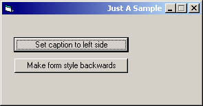

<div align="center">

## Set Caption to Right Side Of Form


</div>

### Description

This is just a sample program that shows how to set the Caption to the right side of your form using API. Also included is a way to make your form appear backwards. I havent seen this done by using API before, Just cheap imitations using strings. !Win2k only!
 
### More Info
 


<span>             |<span>
---                |---
**Submitted On**   |2001-01-20 01:09:44
**By**             |[Billy Conner](https://github.com/Planet-Source-Code/PSCIndex/blob/master/ByAuthor/billy-conner.md)
**Level**          |Intermediate
**User Rating**    |4.7 (28 globes from 6 users)
**Compatibility**  |VB 5\.0, VB 6\.0
**Category**       |[Miscellaneous](https://github.com/Planet-Source-Code/PSCIndex/blob/master/ByCategory/miscellaneous__1-1.md)
**World**          |[Visual Basic](https://github.com/Planet-Source-Code/PSCIndex/blob/master/ByWorld/visual-basic.md)
**Archive File**   |[CODE\_UPLOAD139501202001\.zip](https://github.com/Planet-Source-Code/billy-conner-set-caption-to-right-side-of-form__1-14570/archive/master.zip)

### API Declarations

```
--API Declares---
Function GetWindowLongA Lib "user32"
Function SetWindowPos Lib "user32"
Function SetWindowLongA Lib "user32"
---Constants---
GWL_EXSTYLE
SWP_NOZORDER
SWP_NOMOVE
SWP_NOSIZE
WS_EX_LAYOUTRTL
WS_EX_RIGHT
```


